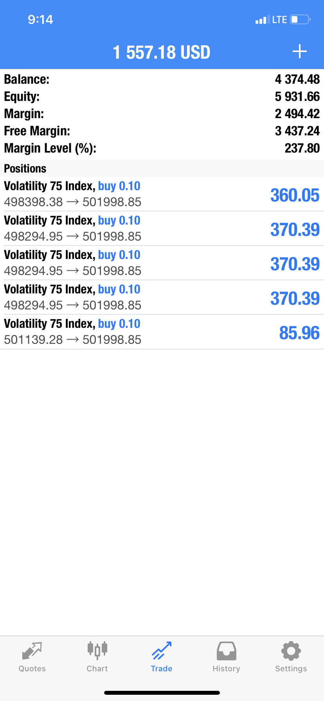

# Volatility 75 is a scam

## Understanding the ins and outs of Volatility 75 on Binary.com / deriv.com

I have been a trader for over 3 years. I was introduced to volatility 75 by a friend 
who swear by it. 

I had successful trades which came with a catch. 
The catch was that even with successful trades you can't take your money out of Deriv.com.

### Internet lies

Most pictures that you see online are internet lies. Like my demo account below..
 

### Deriv.com lies

Deriv.com will give you a false sens of winning. As you win they expect you to put more money that's when they jump in and take it all.
Like you can see my real money below ...

Once you start taking profit, you will start losing trades until all the profit are back and you have accumulated more loss.

Check out some of my crazy trades 

